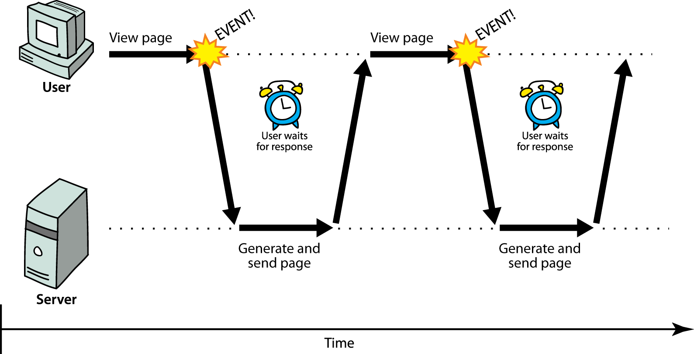
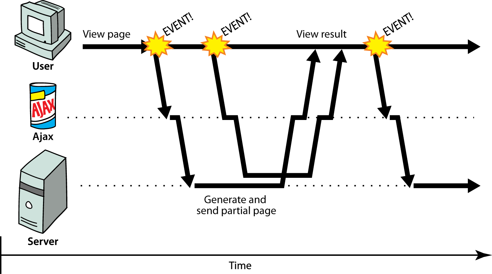

Disclaimers
###########

---------

Arrivée de l'asynchrone côté client 1/2
#######################################

image de Marty Stepp et Jessica Miller

---------

Arrivée de l'asynchrone côté client 2/2
#######################################

image de Marty Stepp et Jessica Miller

---------

Temps Réel
##########

---------

Connexion sens unique
#####################

.. image:: ./_static/sens_unique.jpg
   :scale: 65%

---------

Solution théorique idéale
#########################

::

   Jamais je ne suis loin de mon autre jumelle,
   on m'associe souvent au parfum vomitif
   d'une partie du corps qui n'est pas vraiment belle,
   localisée fort loin de l'organe olfactif.

---------

Solution pratique
#################

image de Marty Stepp et Jessica Miller bidouillée.

---------

Django pas asynchrone
#####################

--------

Technologie
###########

----------

Autres pistes
#############

Image from http://habrahabr.ru/blogs/webdev/108241/

.. image:: ./_static/flask.png
   :scale: 10%

------------

Questions
#########

------------

Infos et slides
###############

http://github.com/Christophe31/djcon_tornado_lt
